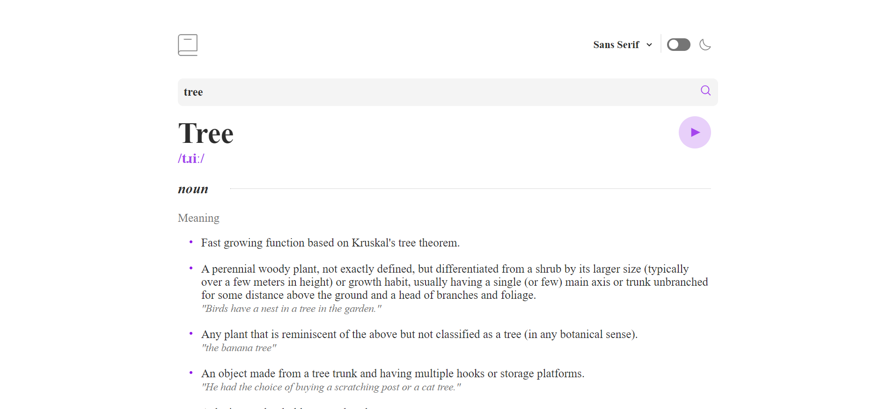
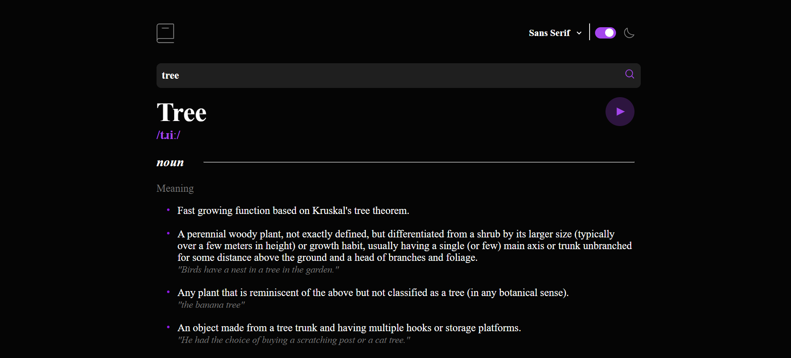

# Dictionary web app solution

This is a real world dictionary application, where you can check definition, synonyms, pronounciations, phonetic audio, parts of speeches etc of any word. This application is dual theme application and supports Serif, Sans-Serif, and Monospace fonts as per user's choice. This application is created based on Angular 14.

## Table of contents

- [Overview](#overview)
  - [The challenge](#the-challenge)
  - [Screenshot](#screenshot)
  - [Links](#links)
- [My process](#my-process)
  - [Built with](#built-with)
  - [What I enjoyed most](#what-i-enjoyed-most)
- [Author](#author)

## Overview

### The challenge

Users should be able to:

- Search for words using the input field
- See the response for the searched word
- See a form validation message when trying to submit a blank form
- Play the audio file for a word when it's available
- Switch between serif, sans serif, and monospace fonts
- Switch between light and dark themes
- View the optimal layout for the interface depending on their device's screen size

### Screenshot

Light theme:

 
Dark Theme:

### Links

- [Solution URL](https://github.com/aknagirm/ng-dictionary-web)
- [Live Site URL](https://aknagirm.github.io/ng-dictionary-web/)

## My process

### Built with

- Semantic HTML5 markup
- CSS custom properties
- Angular 14
- Free dictionary API used from [Free Dictionary API](https://dictionaryapi.dev/)

### What I enjoyed most

Managing the dual theme, without material felt little exciting. In this approach, I loaded two css variable theme files <b>src\app\themes\css_darkTheme.css</b> & <b>src\app\themes\css_lightTheme.css</b> at the build time of the application. Once the build is completed these two files injected to the html as stylesheets. These files contain variables with same name but different color values, which supposed to be set as :root variables. Once that is done, the <b>src\app\components\slider\slider.component.ts</b> changing any one stylesheet to diasable as selected by the user using the slider.

## Author

- Name: Mriganka Sekhar Sarkar
- linkedin - [@mriganka-sekhar-sarkar-974814a2](linkedin.com/in/mriganka-sekhar-sarkar-974814a2)
